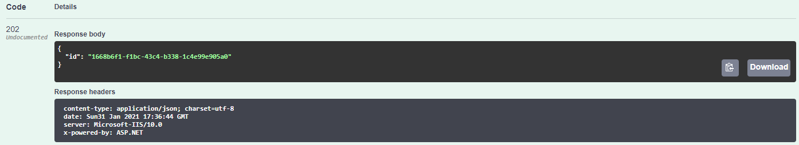
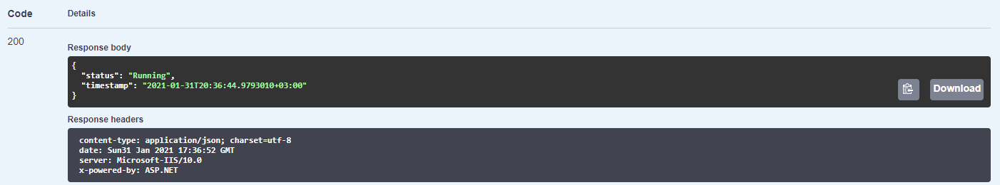
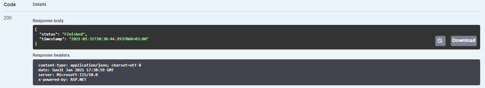

You need to install [PostgreSQL server](https://www.postgresql.org/download/) on your computer. Expected configuration is localhost:5432 host, database and username is 'postgres', password is 'admin'.

After you launch the application you can test API with Swagger UI. Call for POST JobTask method to create a new task. You will receive its Id - copy it.

Then call for GET/{id} method using Id above. This task has been launched at the end of the previous method and now it has 'Running' status.

After 2 minutes call that method again. Now task should be 'Finished'.

